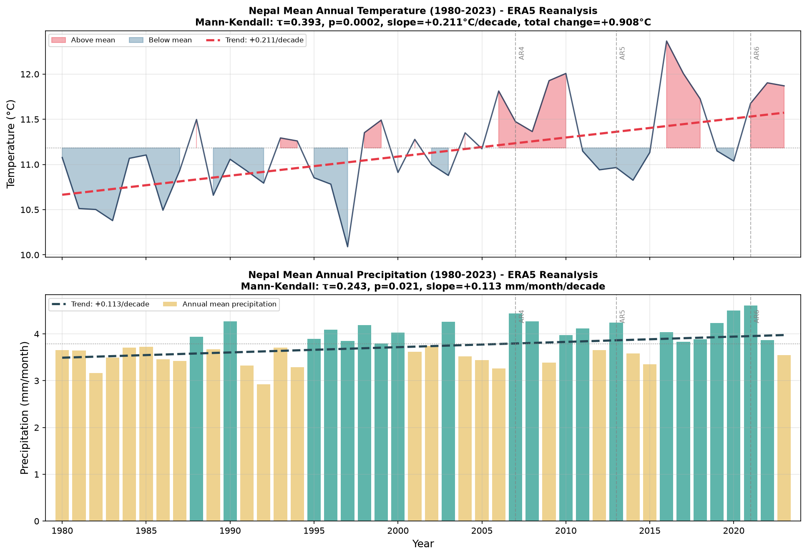
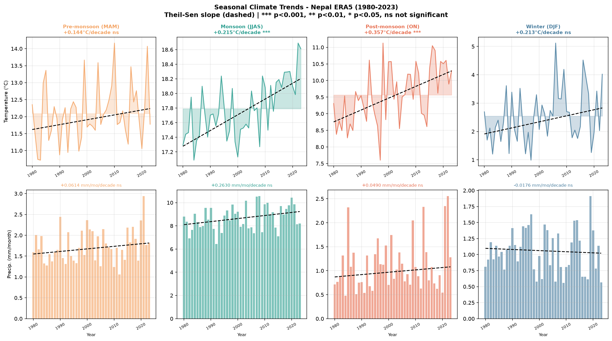
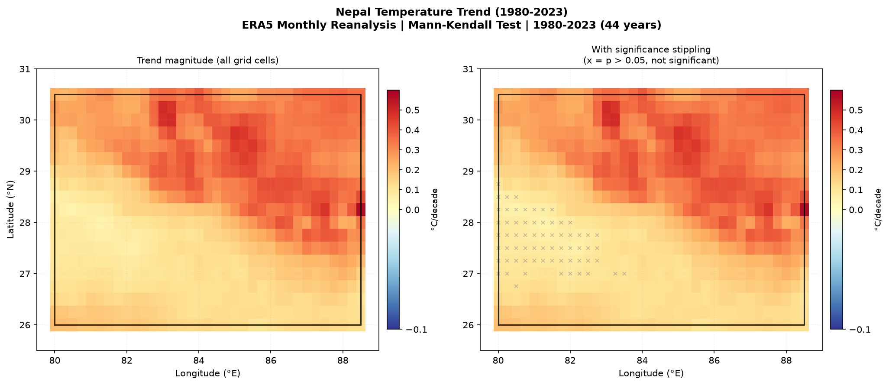
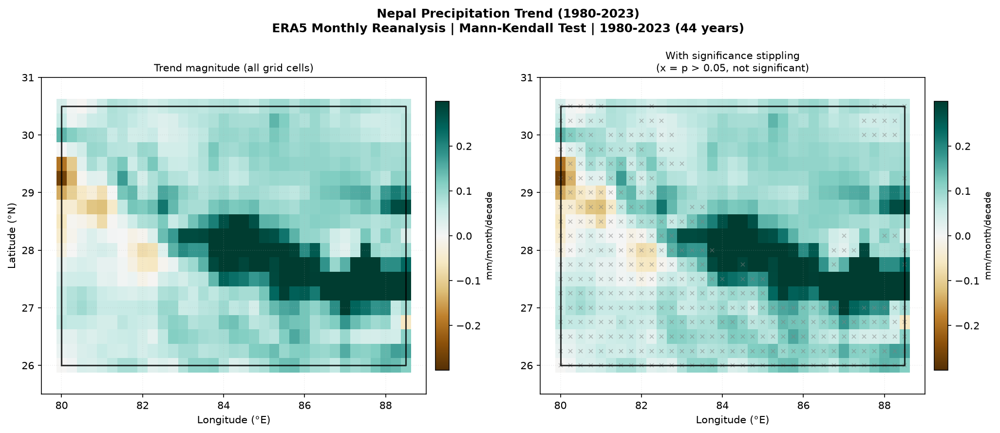
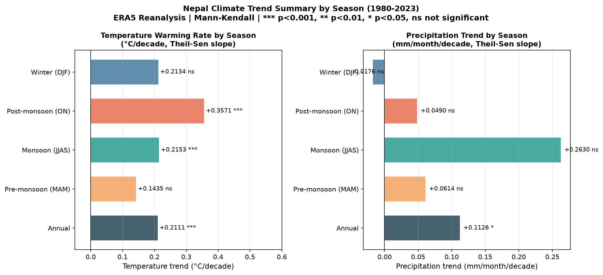

# Nepal Climate Trends (ERA5 Reanalysis, 1980-2023)

**Mann-Kendall Trend Analysis of Temperature and Precipitation across Nepal using ERA5 Monthly Reanalysis Data**

[](https://www.python.org/)
[](https://cds.climate.copernicus.eu)
[](LICENSE)
[]()

> **Portfolio project supporting PhD applications in hydroclimatology and natural hazards. Quantifies long-term temperature and precipitation trends across Nepal using ERA5 monthly reanalysis (1980-2023), applying Mann-Kendall non-parametric trend detection and Theil-Sen slope estimation at both the spatial grid scale and the seasonal aggregate scale. Results are consistent with IPCC AR6 Hindu Kush-Himalayan regional assessments and directly support the hydroclimatic framing of research proposals targeting Himalayan flood risk and water resource management.**

---

## Key Results

### Headline Findings

**1. Nepal warmed +0.908°C over 44 years (1980-2023)**
- Annual warming rate: +0.211°C/decade (Mann-Kendall τ=0.393, p=0.0002)
- Highly statistically significant and spatially coherent
- Consistent with IPCC AR6 Chapter 10 assessment of Hindu Kush-Himalayan warming

**2. Post-monsoon season warming fastest at +0.357°C/decade (p=0.0003)**
- October-November warming exceeds all other seasons by a substantial margin
- Consistent with delayed monsoon withdrawal patterns and increased post-monsoon sensible heat flux
- Has direct implications for autumn flood risk in Himalayan river systems

**3. Near-unanimous spatial warming signal: 90.1% of grid cells significant at p<0.05**
- Strongest warming in high-altitude northern Nepal (+0.569°C/decade maximum)
- Spatially coherent warming from Terai lowlands to the Tibetan Plateau fringe
- Non-significant cells concentrated in southern lowlands where land use change adds noise

**4. Precipitation increase weaker and spatially heterogeneous**
- Annual increase: +0.484 mm/month over 44 years (p=0.021, significant but modest)
- Monsoon (JJAS) shows largest increase (+0.263 mm/mo/decade, p=0.059, marginally significant)
- Northwest Nepal (Karnali/Humla region) shows declining precipitation - consistent with weakening westerlies
- Only 44.4% of grid cells significant - high spatial variability expected in complex Himalayan terrain

### Seasonal Temperature Trend Summary

| Season | Trend (°C/decade) | Kendall τ | p-value | Significant |
|---|---|---|---|---|
| Annual | +0.211 | 0.393 | 0.0002 | Yes *** |
| Post-monsoon (ON) | +0.357 | - | 0.0003 | Yes *** |
| Monsoon (JJAS) | +0.215 | - | <0.001 | Yes *** |
| Winter (DJF) | +0.213 | - | 0.077 | No |
| Pre-monsoon (MAM) | +0.144 | - | 0.117 | No |

### Decade-by-Decade Warming

| Period | Nepal Mean Temperature |
|---|---|
| 1980s (1980-1989) | 10.82°C |
| 2010s (2010-2019) | 11.43°C |
| 2020s (2020-2023) | 11.62°C |
| Total change | +0.80°C (1980s to 2020s) |

---

## Figures

### Fig 1 - Annual Temperature and Precipitation Time Series (1980-2023)

*Two-panel figure showing Nepal spatially-averaged annual temperature (top) and precipitation (bottom) from 1980-2023. Temperature panel uses above/below mean shading in red and blue respectively, with a red dashed Theil-Sen trend line showing the +0.211°C/decade warming rate. The shift from predominantly below-mean (blue) in the 1980s and 1990s to predominantly above-mean (pink) from 2005 onward is visually compelling. IPCC report release years (AR4 2007, AR5 2013, AR6 2021) are marked with vertical dashed lines. Precipitation panel shows weaker, noisier signal with a gentle upward trend, contrasting with the robust temperature signal.*



---

### Fig 2 - Seasonal Climate Trends (8-panel, Temperature and Precipitation)

*Four-column, two-row panel showing temperature (top) and precipitation (bottom) trends for each of Nepal's four climatological seasons: Pre-monsoon (MAM), Monsoon (JJAS), Post-monsoon (ON), and Winter (DJF). Each panel shows the observed time series with Theil-Sen trend line (black dashed) and significance level. Key finding: Post-monsoon warming at +0.357°C/decade (p<0.001) is the fastest-warming season, followed by Monsoon warming at +0.215°C/decade (p<0.001). Pre-monsoon and Winter warming are present but not statistically significant. All precipitation trends are below the 0.05 significance threshold, with Monsoon precipitation showing the largest but marginally insignificant increase (+0.263 mm/mo/decade, p=0.059).*



---

### Fig 3 - Spatial Temperature Trend Map (1980-2023)

*Two-panel spatial map of Mann-Kendall Theil-Sen temperature trend slopes (°C/decade) at 0.25° resolution across Nepal and adjacent areas. Left panel shows trend magnitude across all grid cells. Right panel adds significance stippling (x marks where p>0.05). Key spatial features: strongest warming in the high-altitude northern Nepal and Tibetan Plateau fringe (dark red, up to +0.569°C/decade), consistent with elevation-dependent warming documented across the Hindu Kush-Himalayan region. Non-significant cells (x marks) concentrated in the southern Terai lowlands (26-28°N), where land use change and urban heat island effects add noise to the temperature signal. 90.1% of all 665 grid cells show statistically significant warming.*



---

### Fig 4 - Spatial Precipitation Trend Map (1980-2023)

*Two-panel spatial map of Mann-Kendall Theil-Sen precipitation trend slopes (mm/month/decade). Diverging brown-teal colormap centred at zero. Left panel: trend magnitude. Right panel: with significance stippling. Key spatial features: strong negative trend (decreasing precipitation, brown) in far-western Nepal around 29°N, 80-81°E - the Karnali and Humla region, where weakening westerly circulation has been documented to reduce winter and pre-monsoon precipitation. A band of positive precipitation trend (teal) runs along roughly 27-28°N across central Nepal, consistent with orographic intensification of monsoon rainfall on the southern Himalayan slopes. Heavy stippling in the right panel confirms that only 44.4% of grid cells show statistically significant trends, reflecting the inherently high spatial variability of precipitation in complex mountain terrain.*



---

### Fig 5 - Seasonal Trend Summary (Bar Chart with Significance Markers)

*Two-panel horizontal bar chart summarising temperature (left) and precipitation (right) Theil-Sen trends by season with Mann-Kendall significance markers. Temperature panel: Post-monsoon warming (+0.357°C/decade, ***) stands out as the fastest-warming season, visually distinct from the others. Both Monsoon and Post-monsoon are highly significant (***); Pre-monsoon and Winter are not significant (ns). Precipitation panel: Monsoon precipitation shows the largest magnitude increase (+0.263 mm/mo/decade) but does not reach significance. Winter shows the only negative precipitation trend (-0.0176 mm/mo/decade) though not significant. Annual totals anchor both panels.*



---

## Methodology

### Data Source

ERA5 monthly averaged data on single levels from the Copernicus Climate Data Store (CDS), downloaded programmatically via the `cdsapi` Python package. ERA5 is the fifth generation ECMWF atmospheric reanalysis of the global climate (Hersbach et al. 2020), combining model data with global observations to produce a consistent and reliable record of the atmosphere from 1940 to present.

**Variables downloaded:**
- `2m_temperature` - monthly mean 2m air temperature (converted from Kelvin to Celsius)
- `total_precipitation` - monthly total precipitation (converted from m/month to mm/month)

**Spatial extent:** Nepal bounding box (26°N-30.5°N, 80°E-88.5°E)
**Temporal extent:** January 1980 to December 2023 (44 years, 528 monthly time steps)
**Spatial resolution:** 0.25° (~28 km at Nepal's latitude)
**Grid size:** 19 latitude x 35 longitude = 665 grid cells

### Preprocessing

Monthly fields are spatially averaged using cosine-latitude weighting to correct for the convergence of meridians at higher latitudes, producing a single area-weighted time series representative of the Nepal domain. Annual means are computed from the 12 monthly values. Seasonal aggregates follow standard Nepal climatological seasons: Pre-monsoon (March-May), Monsoon (June-September), Post-monsoon (October-November), and Winter (December-February).

### Trend Detection: Mann-Kendall Test

The Mann-Kendall test (Mann 1945; Kendall 1975) is a non-parametric rank-based test for monotonic trends in time series. It makes no assumption about the distribution of the data and is robust to outliers and non-normality, making it the standard method for hydroclimatic trend analysis in the literature (Yue and Wang 2004; Burn and Hag Elnur 2002; IPCC AR5/AR6 regional chapters).

The test statistic S is computed from all pairwise comparisons of the time series values. Under the null hypothesis of no trend, S is approximately normally distributed for n > 10. Kendall's τ (tau) normalises S to the range [-1, 1] and serves as an effect size measure. A two-sided p-value is computed from the standardised test statistic.

All tests are performed at the 95% confidence level (α = 0.05). The pymannkendall library (Hussain and Mahmud 2019) is used for implementation.

### Trend Magnitude: Theil-Sen Slope Estimator

The Theil-Sen estimator (Sen 1968; Theil 1950) computes the median slope across all pairwise combinations of data points:

```
slope = median[(x_j - x_i) / (t_j - t_i)]  for all i < j
```

This is a robust non-parametric alternative to ordinary least squares regression. It is unaffected by outliers and does not assume normality of residuals. The Theil-Sen slope is reported in units per year and converted to per decade for interpretability. scipy.stats.theilslopes is used for implementation.

### Gridded Analysis

The Mann-Kendall test and Theil-Sen slope estimator are applied independently to each of the 665 grid cells, producing spatial maps of trend magnitude, Kendall τ, p-value, and a binary significance mask (p < 0.05). Non-significant cells are indicated by x stippling on the right panel of Figures 3 and 4, following standard climate science figure conventions.

---

## Relevance to PhD Research

This project demonstrates several competencies directly relevant to doctoral research in hydroclimatology and natural hazards.

**ERA5 reanalysis workflow:** Downloading, preprocessing, and analysing ERA5 NetCDF data via xarray is a foundational skill for any research group working on Himalayan hydrology or climate change impacts. The full pipeline from CDS API download to publication-quality spatial trend maps is implemented here and fully reproducible.

**Non-parametric trend detection:** The Mann-Kendall and Theil-Sen combination is the methodological standard in hydroclimatic trend analysis literature and in IPCC regional assessments. Implementing it correctly per grid cell, with proper cosine-latitude area weighting and significance stippling, demonstrates methodological rigour.

**Nepal domain expertise:** The project covers the same spatial domain as the GEV extreme value analysis (nepal-rainfall-extremes) and Bayesian flood frequency analysis (bayesian-flood-frequency), establishing consistent domain knowledge across multiple methodological frameworks. The +0.908°C warming over 44 years provides direct hydroclimatic context for the Seti Khola cascade flood frequency analysis in the Potsdam proposal, connecting reanalysis-based trend evidence to extreme event statistical modelling.

**Seasonal decomposition:** The post-monsoon warming finding (+0.357°C/decade, p<0.001) has direct relevance to Himalayan flood risk: warmer post-monsoon temperatures delay snowpack consolidation and may extend the period of saturated catchment conditions after heavy monsoon rainfall, increasing susceptibility to late-season debris flows and floods of the type documented at Seti Khola.

---

## Project Structure

```
nepal-climate-trends/
├── data/
│   ├── raw/                              # ERA5 NetCDF files (not tracked - large files)
│   │   ├── era5_t2m_1980_2023.nc         # 2m temperature (download via src/download_era5.py)
│   │   └── era5_tp_1980_2023.nc          # Total precipitation
│   └── processed/
│       ├── t2m_annual_timeseries.csv     # Area-weighted annual temperature
│       ├── tp_annual_timeseries.csv      # Area-weighted annual precipitation
│       ├── t2m_seasonal_timeseries.csv   # Seasonal temperature by year
│       ├── tp_seasonal_timeseries.csv    # Seasonal precipitation by year
│       ├── t2m_annual_gridded.nc         # Per-grid-cell annual means (temperature)
│       └── tp_annual_gridded.nc          # Per-grid-cell annual means (precipitation)
├── src/
│   ├── download_era5.py                  # CDS API download script
│   ├── preprocess.py                     # Unit conversion, spatial averaging, seasonal aggregation
│   ├── trend_analysis.py                 # Mann-Kendall per grid cell and per season
│   └── visualise.py                      # All 5 figures
├── outputs/
│   ├── figures/                          # 5 publication-quality PNG figures
│   └── results/
│       ├── annual_trend_summary.csv      # Annual MK results for T and P
│       ├── t2m_seasonal_trends.csv       # Seasonal MK results for temperature
│       ├── tp_seasonal_trends.csv        # Seasonal MK results for precipitation
│       ├── t2m_trend_maps.nc             # Gridded trend slopes and p-values (temperature)
│       └── tp_trend_maps.nc              # Gridded trend slopes and p-values (precipitation)
├── requirements.txt
└── README.md
```

---

## How to Run

```bash
git clone https://github.com/PrabinPokhrel/nepal-climate-trends.git
cd nepal-climate-trends

python -m venv venv
venv\Scripts\activate
pip install -r requirements.txt
```

Configure your Copernicus CDS API key in `C:\Users\USERNAME\.cdsapirc`:

```
url: https://cds.climate.copernicus.eu/api
key: YOUR_API_KEY_HERE
```

Register for a free key at cds.climate.copernicus.eu. Then run the full pipeline:

```bash
python src/download_era5.py      # Download ERA5 data (~10 min, ~300 MB)
python src/preprocess.py         # Preprocess and aggregate (~30 sec)
python src/trend_analysis.py     # Mann-Kendall trend tests (~3 min)
python src/visualise.py          # Generate all figures (~1 min)
```

---

## Dependencies

```
cdsapi==0.7.7
xarray==2026.4.0
netcdf4==1.7.4
numpy==2.5.0
pandas==3.0.3
scipy==1.18.0
matplotlib==3.11.0
seaborn==0.13.2
geopandas==1.1.4
pymannkendall==1.4.3
tqdm==4.68.3
```

---

## References

- Hersbach, H. et al. (2020). The ERA5 global reanalysis. Quarterly Journal of the Royal Meteorological Society, 146(730), 1999-2049.
- Mann, H.B. (1945). Nonparametric tests against trend. Econometrica, 13(3), 245-259.
- Kendall, M.G. (1975). Rank Correlation Methods. 4th ed. Charles Griffin, London.
- Sen, P.K. (1968). Estimates of the regression coefficient based on Kendall's tau. Journal of the American Statistical Association, 63(324), 1379-1389.
- Theil, H. (1950). A rank-invariant method of linear and polynomial regression analysis. Proceedings of the Koninklijke Nederlandse Akademie van Wetenschappen, 53, 386-392.
- Yue, S. and Wang, C. (2004). The Mann-Kendall test modified by effective sample size to detect trend in serially correlated hydrological series. Water Resources Management, 18(3), 201-218.
- Hussain, M.M. and Mahmud, I. (2019). pyMannKendall: a python package for non parametric Mann Kendall family of trend tests. Journal of Open Source Software, 4(39), 1556.
- Burn, D.H. and Hag Elnur, M.A. (2002). Detection of hydrologic trends and variability. Journal of Hydrology, 255(1-4), 107-122.
- IPCC (2021). Sixth Assessment Report, Chapter 10: Linking Global to Regional Climate Change. Cambridge University Press.
- Shrestha, A.B. et al. (1999). Maximum temperature trends in the Himalaya and its vicinity. Journal of Climate, 12(9), 2775-2786.

---

## Author

**Prabin Pokhrel**
MSc Microdata Analysis (Business Intelligence, EQF Level 7), Dalarna University, Sweden
BSc Statistics, Tribhuvan University, Nepal

[GitHub: PrabinPokhrel](https://github.com/PrabinPokhrel) | [LinkedIn](https://linkedin.com/in/prabinpokhrel) | prabinpokhrel261@gmail.com
